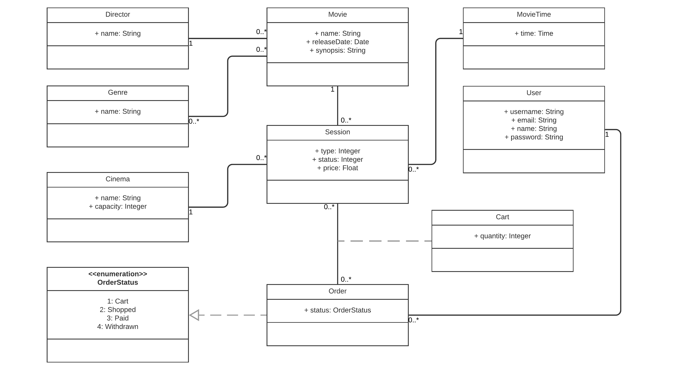

# CinePy

## Descrição

O projeto tem o intuito fornecer um sistema capaz de facilitar a visualização de dados, a tomada de decisões e controle de salas de cinemas. O usuário administrador possuirá o privilégio de cadastrar diretores, gêneros, filmes, salas de cinema, horário de sessões e sessões. O usuário padrão poderá efetuar a compra de ingressos.

## Diagrama de classes

## Deploy

https://cinepy-devweb2.herokuapp.com/

- login: admin
- senha: admin

## Endpoints
- genre-viewset/
- director-viewset/
- cinema-viewset/
- movietime-viewset/
